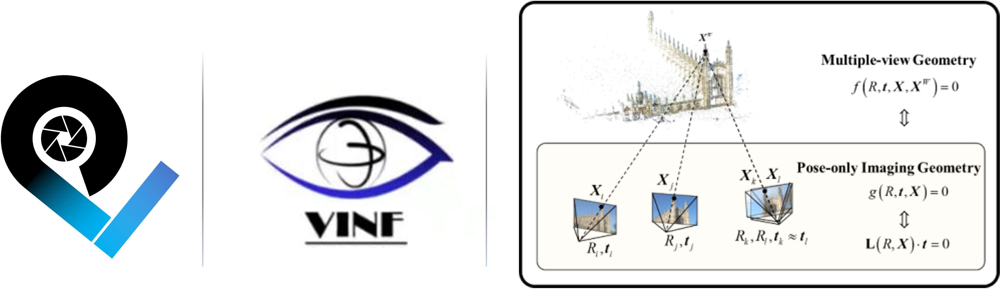

# PoSDK for Spatial Visual Computing

<div align="center">

<!-- Main Project Logo -->

 
| License                                                                               | Documentation                                                                                            | Continuous Integration                                               | Build                                                                                                      | Code Quality                                                                             | Chat                                                                     |
| ------------------------------------------------------------------------------------- | -------------------------------------------------------------------------------------------------------- | -------------------------------------------------------------------- | ---------------------------------------------------------------------------------------------------------- | ---------------------------------------------------------------------------------------- | ------------------------------------------------------------------------ |
| [](LICENSE) | [](https://posdk.readthedocs.io) | [](#) | [](docs/source/installation/index.md) | [](#) | [](#) |

</div>


## Our Vision

PoSDK is designed for **Spatial Visual Computing** applications including camera pose estimation, feature point cloud generation, and advanced 3D reconstruction workflows. Built on innovative **Pose-only Imaging Geometry** theory, PoSDK provides efficient and robust solutions for lightweight, embedded vision computing applications such as robotic navigation, spatial computing, and mixed reality systems.

## Key Features

- **Pose-only Imaging Geometry Theory**: An approach that decouples pose estimation from 3D scene reconstruction, eliminating high-dimensional joint optimization
- **Modular Plugin System**: Flexible DataPtr/MethodPtr architecture for seamless algorithm integration and extension
- **High-Performance Engine**: Built-in performance profiler with real-time memory, CPU, and timing monitoring
- **Automatic Evaluation System**: Comprehensive accuracy evaluator with statistical analysis and CSV export capabilities
- **Copyright Tracking System**: Automated intellectual property protection with dependency tracking and compliance management
- **Cross-platform Support**: Native support for macOS (x86_64/arm64) and Linux (x86_64/aarch64)
- **Platform Integration**: Seamless integration and benchmarking with OpenMVG, COLMAP, GLOMAP, and other mainstream 3D reconstruction platforms

## Architecture Overview

PoSDK employs a comprehensive architecture design that integrates multiple components from data preprocessing to core computation engine:

<div align="center">

</div>

The architecture demonstrates the complete workflow from input processing through various specialized modules to final platform integration:

- **Input Layer**: Dynamic input processing and cross-platform integration capabilities
- **Processing Modules**: Image feature extraction, copyright tracking, and advanced 3D techniques (3DGS/NeRF)
- **SDK Framework**: Comprehensive development framework for user applications
- **Core Engine**: PoCore engine powered by pose-only imaging geometry algorithms
- **Output Integration**: Seamless integration with platforms, SDK distribution, and core services

## Quick Documentation Links

**Online Documentation**
- **[Complete Documentation](https://posdk.readthedocs.io)** - Official documentation on ReadTheDocs
- **[Source Documentation](docs/source/)** - Documentation source files in GitHub

**Quick Access**
- **[User Guide](https://posdk.readthedocs.io/en/latest/introduction.html)** - Complete introduction and feature overview
- **[Installation Guide](https://posdk.readthedocs.io/en/latest/installation/)** - Step-by-step setup instructions
- **[Quick Start](https://posdk.readthedocs.io/en/latest/installation/using_precompiled.html)** - Get running in minutes with precompiled binaries
- **[Plugin Development](https://posdk.readthedocs.io/en/latest/basic_development/)** - Create custom algorithms and extensions
- **[Benchmark Results](https://posdk.readthedocs.io/en/latest/benchmark_comparison/)** - Performance comparison with mainstream platforms
- **[Copyright Tracking](https://posdk.readthedocs.io/en/latest/copyright_tracking.html)** - Automated IP protection system

> **Collaboration Note**: This project now supports collaborative documentation editing! Contributors can directly edit Markdown files in `docs/source/` and submit PRs for documentation improvements.

**Local Documentation Build**
```bash
# One-click setup: Install environment + Build documentation
cd docs && ./install_docs.sh

# View the built documentation:
# English: build/html/index.html
# Chinese: build_zh/html/index.html
```

## Quick Start

### Prerequisites
- CMake 3.15+
- C++17 compatible compiler
- Git

### Installation

```bash
# 1. Clone repository
git clone https://github.com/pose-only-vision/PoSDK.git
cd PoSDK

# 2. One-click installation (supports resume on timeout)
./install.sh
```

**Features:**
- **Resume Installation** - Re-run `./install.sh` if network timeouts occur
- **Automated Setup** - Downloads dependencies, builds PoSDK, and prepares test data
**For Poor Network Conditions:**
If automatic download fails, manually download from [GitHub Releases](https://github.com/pose-only-vision/PoSDK/releases/tag/v1.0.0) and copy files directly (<span style="color: red;">no extraction needed</span>):
- `po_core` + `PoSDK dependencies` → `./dependencies/`
- `PoSDK_test_data` → `./tests/`

Then run `./install.sh` to complete setup.

### Usage

```bash
# Build PoSDK (if not done during installation)
mkdir build && cd build
cmake ..
make -j$(nproc)

# Run PoSDK from build directory
./output/bin/PoSDK
```

### Output Results 

PoSDK generates comprehensive results in the working directory:

#### Directory Structure 
- **`globalsfm_pipeline_work/`** - Main working directory (configured in `globalsfm_pipeline.ini`)
- **`[dataset_name]/`** - Individual dataset results with 3D reconstruction and MeshLab outputs
- **`summary/`** - Performance analysis and evaluation reports

#### Summary Reports 
| Report File                                                 | Description                                                                             |
| ----------------------------------------------------------- | --------------------------------------------------------------------------------------- |
| `profiler_performance_summary.csv`                          | **Performance Metrics** - CPU, memory usage, and execution timing                       |
| `summary_GlobalPoses_rotation_error_deg_ALL_STATS.csv`      | **Global Rotation Accuracy** - Statistical analysis of rotation estimation errors       |
| `summary_GlobalPoses_translation_error_ALL_STATS.csv`       | **Global Translation Accuracy** - Statistical analysis of translation estimation errors |
| `summary_RelativePoses_rotation_error_deg_ALL_STATS.csv`    | **Relative Rotation Accuracy** - Pairwise rotation error statistics                     |
| `summary_RelativePoses_translation_error_deg_ALL_STATS.csv` | **Relative Translation Accuracy** - Pairwise translation error statistics               |

## Why Pose-only Imaging Geometry? 

Traditional computer vision methods often face challenges when dealing with large-scale scenes:
- **Curse of dimensionality** in high-dimensional optimization
- **Computational inefficiency** in joint pose-structure estimation
- **Robustness issues** in complex scenarios

**Pose-only Imaging Geometry** offers a paradigm shift by:
- **Lossless representation** of high-dimensional 3D scenes on low-dimensional pose manifolds
- **Complete decoupling** of camera pose estimation and 3D scene reconstruction
- **Enhanced robustness** without ultra-high-dimensional joint optimization

## Platform Integration & Benchmarking 

PoSDK provides comprehensive comparison with mainstream 3D reconstruction platforms:

| Platform    | Focus                       | Integration Status    |
| ----------- | --------------------------- | --------------------- |
| **OpenMVG** | Classic Multi-View Geometry | Fully Integrated      |
| **COLMAP**  | Industry-leading SfM/MVS    | Fully Integrated      |
| **GLOMAP**  | Global Optimization SfM     | Fully Integrated      |
| **PoSDK**   | Pose-only Geometry          | Native Implementation |

**[View Detailed Benchmark Results →](https://posdk.readthedocs.io/en/latest/benchmark_comparison/)**

## Research Foundation 

PoSDK is built on peer-reviewed research in pose-only imaging geometry:

### Key Publications

```bibtex
@article{cai2019equivalent,
  title={Equivalent Constraints for Two-View Geometry: Pose Solution/Pure Rotation Identification and 3D Reconstruction},
  journal={International Journal of Computer Vision},
  volume={127}, pages={163--180}, year={2019},
  doi={10.1007/s11263-018-1136-9}
}

@article{cai2023pose,
  title={A Pose-only Solution to Visual Reconstruction and Navigation},
  journal={IEEE Transactions on Pattern Analysis and Machine Intelligence},
  volume={45}, number={1}, pages={73--86}, year={2023},
  doi={10.1109/TPAMI.2021.3139681}
}
```
## Supported Platforms 

| Platform         | Architecture          | Status          |
| ---------------- | --------------------- | --------------- |
| **macOS**        | arm64 (Apple Silicon) | Fully Supported |
| **Ubuntu 24.04** | x86_64                | Fully Supported |
| **Ubuntu 24.04** | aarch64               | Fully Supported |


## License Compliance

If you identify any open-source license compliance issues with PoSDK, please notify us immediately through [GitHub Issues](https://github.com/pose-only-vision/PoSDK/issues). We are committed to maintaining compliance with all open-source licenses and will address any concerns promptly.

## Community & Support 

- **Documentation**: [ReadTheDocs](https://posdk.readthedocs.io)
- **Issues**: [GitHub Issues](https://github.com/pose-only-vision/PoSDK/issues)
- **Discussions**: [GitHub Discussions](https://github.com/pose-only-vision/PoSDK/discussions)

---

**Version**: v1.0.0 | **Architecture**: Single Repository | **Last Updated**: 2025-01-16